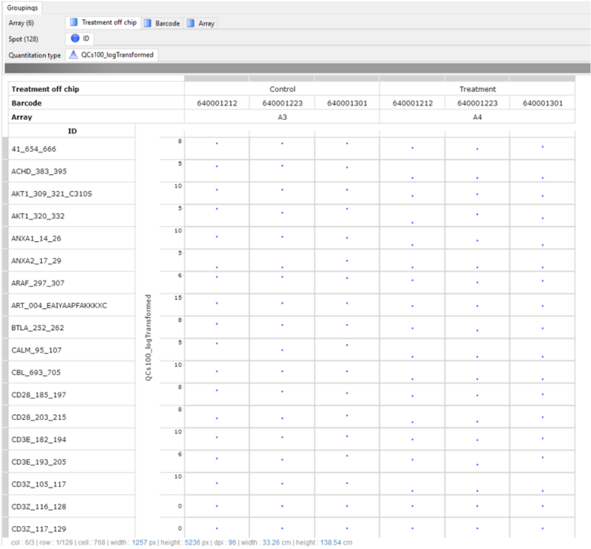

# UKA_app

##### Description

`UKA_app` is an application that allows user to perform an upstream kinase analysis for serine threonine kinases.

##### Details

* This application performs a two group comparison between kinase activity (Here use Log2 Signals of the 2 groups) or kinase inhibition profiles (Here use the Log2 Fold Change/ LFC/ LogRatio/ Delta values of each sample. Make sure the "control" LFC value is removed, and the LFC of the 2 Groups/ Classes are included. For example, The Group can be Responder and Non-Responder ex vivo inhibition profiles). The analysis is performed in terms of kinases rather than individual peptides. Hence the input data is similar (and similarly pre-processed) to that used with PamApp for Two Group Comparison. NOTE: In order to visualise the correct effect DIRECTION, "Control" (=denominator in the comparison) should be of a lower alphabet or number. Numeric characters precede alphabets)
* Example input data:

* As the app includes an analysis of the difference between two experimental groups, peptides should not be pre-selected for input based on such differences:
 - Do not select the significant peptides only!
It is useful to pre-select peptides based on general QC consideration (e.g. by removing peptides with low or absent signals).

The input data is the [UKA dataset]()

This workflow has 3 operators:

* [identity_operator](https://github.com/tercen/identity_operator)
* [upstream_kinase_operator](https://github.com/tercen/upstream_kinase_operator)
* [kinome_render_operator](https://github.com/tercen/kinome_render_operator)

##### See Also

[UKA_app](https://github.com/tercen/UKA_app)
